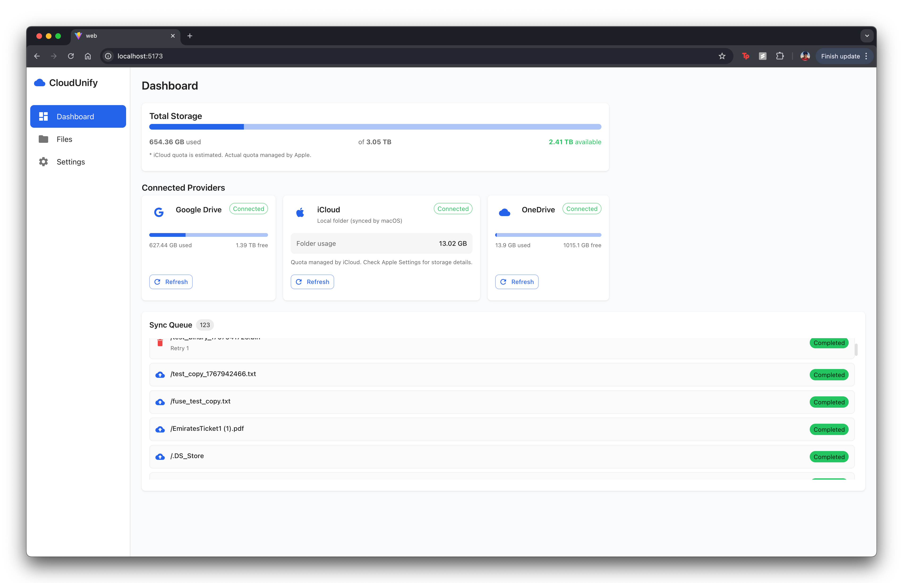

# CloudUnify

A unified cloud storage system that mounts multiple cloud providers (Google Drive, OneDrive, iCloud) as a single virtual filesystem at `~/CloudUnify`. Copy files to the folder and they automatically sync to the cloud.

<!-- Add image -->
<!-- docs/images/dashboard.png -->



## Features

- **Unified Mount Point** - All cloud storage appears as a single `~/CloudUnify` folder
- **Drag-and-Drop Upload** - Copy files via Finder or terminal, they upload automatically
- **Google Drive Integration** - OAuth 2.0 with resumable uploads for large files
- **Background Sync** - Multi-worker queue with retry logic
- **Web Dashboard** - Real-time progress and storage visualization

## Quick Start

### Prerequisites

| Requirement | Install Command |
|-------------|-----------------|
| Go 1.21+ | `brew install go` |
| Node.js 18+ | `brew install node` |
| macFUSE | `brew install --cask macfuse` |

After installing macFUSE, approve the kernel extension in **System Settings > Privacy & Security**, then restart your Mac.

### 1. Set Up Google Drive Credentials

```bash
export GOOGLE_CLIENT_ID="your-client-id"
export GOOGLE_CLIENT_SECRET="your-client-secret"
```

### 2. Build and Run

```bash
make build
./bin/cloudunify
```

### 3. Connect Your Account

1. Open http://localhost:8080
2. Click **Add Provider** and select **Google Drive**
3. Complete OAuth authentication

### 4. Start Using

```bash
# Copy files via terminal
cp ~/Downloads/file.pdf ~/CloudUnify/

# Or drag and drop in Finder
```

## Documentation

| Document | Description |
|----------|-------------|
| [SPEC.md](SPEC.md) | Full feature specification and roadmap |
| [CLAUDE.md](CLAUDE.md) | Developer guide and architecture reference |

## Basic Usage

### Check Upload Status

```bash
curl http://localhost:8080/api/sync/queue | jq
curl http://localhost:8080/api/files | jq
```

### Web Dashboard (Optional)

```bash
cd web && npm install && npm run dev
```

Access at http://localhost:5173

## Troubleshooting

| Problem | Solution |
|---------|----------|
| Mount point busy | `umount ~/CloudUnify` or `diskutil unmount force ~/CloudUnify` |
| Files not uploading | Check `curl http://localhost:8080/api/providers` and logs at `/tmp/cloudunify.log` |
| OAuth errors | Verify `GOOGLE_CLIENT_ID` and `GOOGLE_CLIENT_SECRET` are set |

## Project Status

**Working:** FUSE mount, Finder drag-and-drop, terminal copy, Google Drive OAuth, background sync, web dashboard

**Planned:** OneDrive, iCloud, smart file distribution, download on read

## License

MIT
